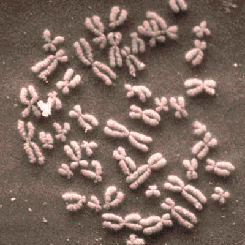
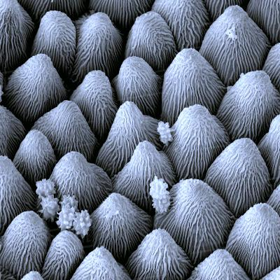
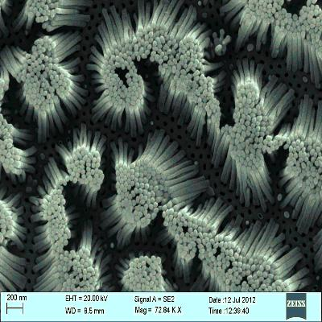
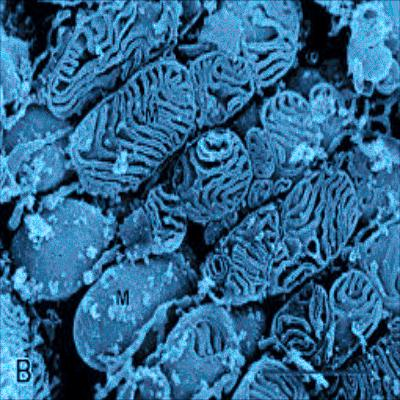
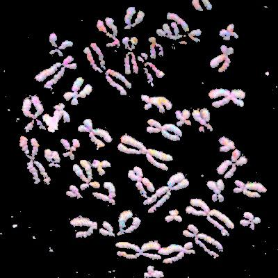
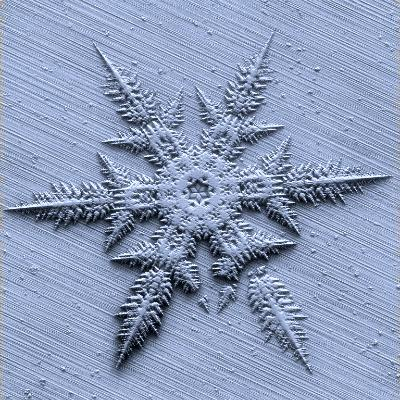
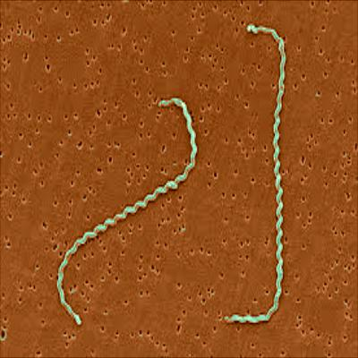
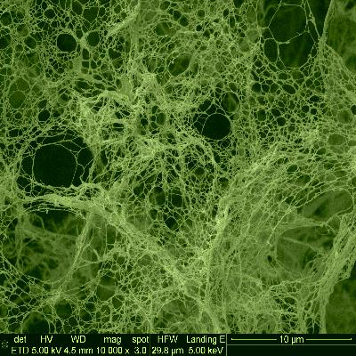

# Nanoscale Microscopy Images Colourization Using Neural Networks
[Project](https://github.com/isrugeek/semcolour) | [Arxiv](https://arxiv.org/abs/1912.07964) |
[Dataset](https://github.com/isrugeek/semcolour/tree/master/datasets) |
[Dataset_2](https://drive.google.com/open?id=1F-movFr2ukPzdkBobrzarrB1DMa_1WxG)

Keras implementation for learning a mapping from SEM gray images to colorful images, for example:


<p float="left">







</p>


Nanoscale Microscopy Images Colourization Using Neural Networks
<!--- [Israel Goytom](http://isrugeek.github.io), [Qin Wang](.),[Xinfei Zhou](.),Cong Liu,[Dong Dong Lin](www.dongdonglin.cn)
 Nature communication, 2019. -->


**Note**: Please check out our [Tensorflow](https://github.com/isrugeek/semcolour) implementation for End2End ColorNet(End2End.ipynb) and CNN-NST(cnn_nst.ipynb).

## Setup

### Prerequisites
- Linux or OSX
- NVIDIA GPU + CUDA CuDNN (CPU mode and CUDA without CuDNN may work with minimal modification, but untested)
- Keras with tensorflow backend

### Getting Started
- Install keras with tensorflow backend and dependencies from https://keras.io/#installation
- Install python packages `jupyter-notebook`, `scikit-image` and `opencv` 
```bash
pip install scikit-image
pip install jupyter
pip install opencv-python
```
- Install [livelossplot](https://github.com/stared/livelossplot)(optional) - a live monitor during training.

- Clone this repo:
```bash
git clone https://github.com/isrugeek/semcolour
cd semcolour
```
# End2End Training Network
check the code in `End2End.ipynb`.
## Train
Setting the right gpu configure.
ex:
```bash
os.environ["CUDA_VISIBLE_DEVICES"]="0,1,2"
```
Variable `iteration` means epochs, change these settings for your own conditions.
```bash
# global varibles
trainset_path = "datasets/trainset"
devset_path = "datasets/devset"
testset_path = "datasets/testset"
batch_size = 16
# epochs
iteration = 100

target_size = (256, 256)
```
## Test
Run the last cell in the `End2End.ipynb` file to test the datasets which in `devset_path` and save these to `results` directory.

## Note
`flow_from_directory_regress.py` is rewrite the class `ImageDataGenerator`, adding `register_batch_process` method to make
our preprocess process more convenient, make sure u have this py file in your work directory.

## Datasets
We collected 800 colorful sem-images as `SEMCOLORFUL1.0` in the `datasets` directory split into `devset` and `trainset`.

## Models
The pre-trained models `pretrained_end2end_model.h5` can be loaded by running follow line.
```bash
model.load_weights('pretrained_end2end_model.h5')
```
after load the pretrained weights, you can test the model directly instead of training.


# CNN neural style transfer Network
## Train & Test
Check the code in `cnn_nst.ipynb`. 
`reference_img` indicates the reference images, `dir_sem` is the directory which contains SEM gray images, `sem_input` indicates specific the input gray sem image.
It doesn't like traditional neural style transfer process, It just learn how to map reference image from gray to color by CNN, then using the weights of the CNN to map the SEM input image to colorful image.
`same_grey_same_colorize` function can provide a constraint to put same color on the parts which are same gray level,it can correct some CNN's mistakes.

## Citation
If you use this code for your research, please cite our paper Nanoscale Microscopy Images Colourization Using Neural Networks <a href="https://arxiv.org/pdf/1611.07004v1.pdf">
</a>:

```
@article{goytom2019nanoscale,
  title={Nanoscale Microscopy Images Colourisation Using Neural Networks},
  author={Goytom, Israel and Wang, Qin and Yu, Tianxiang and Sankaran, Kris and Lin, Dongdong},
  journal={arXiv preprint arXiv:1912.07964},
  year={2019}
}
```

